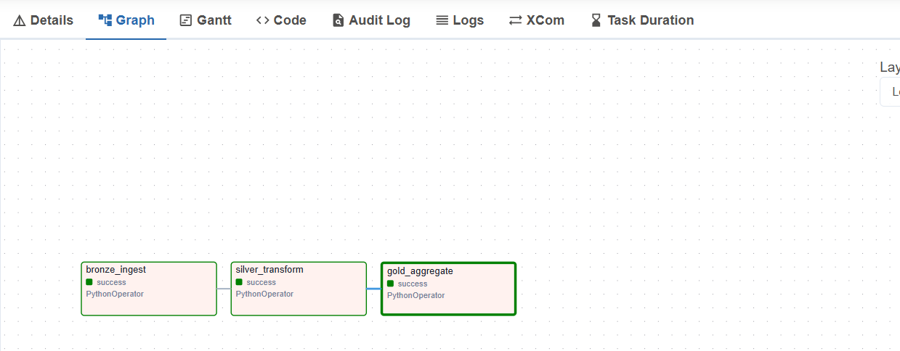
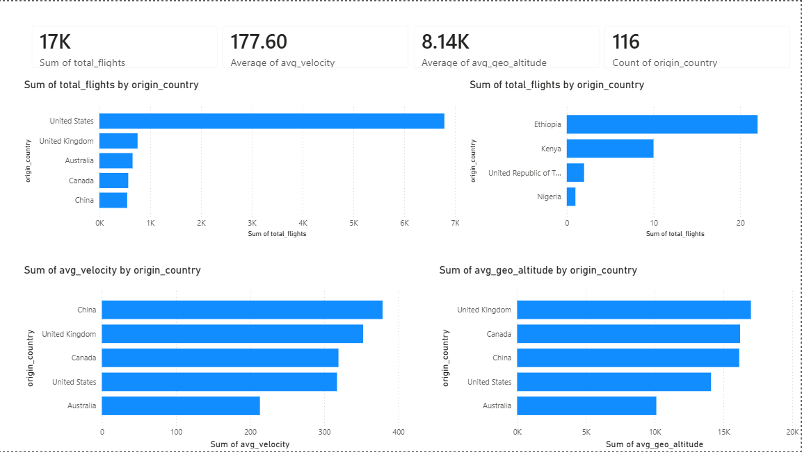

## ✈️ Flight Operations Real-Time Medallion Pipeline
This is an automated, containerized data engineering pipeline that ingests real-time global flight tracking telemetry from the OpenSky Network API, orchestrates multi-stage ETL transformations using the Medallion Architecture, and serves aggregated business metrics directly to a live Power BI dashboard.
------------------------------

## System Architecture
The pipeline is orchestrated across three distinct relational/file layers using a scheduled cron execution cycle to ensure transactional reliability and analytical speed.

   1. Ingestion (API): Airflow queries the OpenSky live API via Python every 30 minutes.
   2. Bronze Layer (Raw): Captures raw payload attributes and flattens JSON structures directly into structural, daily raw CSV files.
   3. Silver Layer (Cleaned): Cleans column schemas, filters out anomalous state vectors, and selects targeted performance dimensions (icao24, origin_country, velocity, geo_altitude).
   4. Gold Layer (Aggregated): Compiles operational business telemetry (flight counts and average velocities grouped by country) to serve pre-calculated analytical subsets.
   5. Visualization (BI): Power BI monitors the Gold storage partition through a Microsoft Data Gateway for fully automated, hands-off reporting updates.

------------------------------
## Technical Stack

* Orchestration: Apache Airflow
* Containerization: Docker & Docker Compose
* Languages: Python (Pandas, Pathlib, Json)
* Data Architecture: Medallion Framework (Bronze >> Silver >> Gold)
* Business Intelligence: Power BI Desktop & Power BI Cloud Service

------------------------------
## Airflow DAG Execution Graph
The pipeline relies on a custom, strict data serialization strategy. airflow-init handles conditional health checking states on the core database before letting downstream operations interact with task structures:

* bronze_ingest: Fetches state vectors and outputs absolute directory pointers via Airflow XCom.
* silver_transform: Pulls the active XCom reference, executes schema validations, and yields a secondary pointer.
* gold_aggregate: Generates production tables optimized for business report execution times.

------------------------------
## 📈 Power BI Live Dashboard Integration
Instead of binding directly to a single static file, the reporting infrastructure is connected natively to the Gold folder context.

------------------------------
## ⚙️ Setup & Local Deployment## Prerequisites

* Docker Desktop installed
* Power BI Desktop installed

## Execution Steps

   1. Clone this repository to your local directory:
   
   git clone https://github.com/iganabrian/Real-time-Flight-operations-Data-Engineering-

   cd flight-ops-airflow
   
   2. Build and launch the container ecosystem in detached mode:
   
   docker compose up -d
   
   3. Access the Airflow UI dashboard via your browser:
   * URL: http://localhost:8080 (or configured port)
      * Toggle the flights_ops_medallion_pipe DAG switch to active to watch the ingestion pipeline run live.
   

